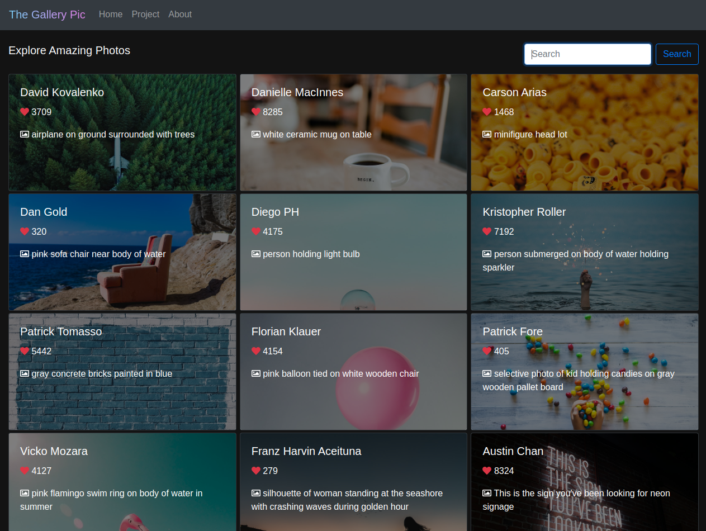
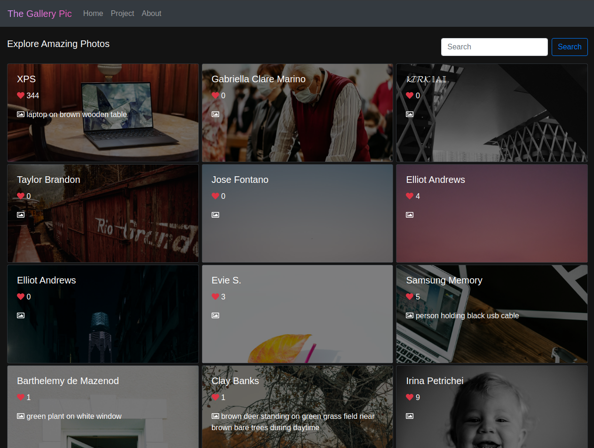
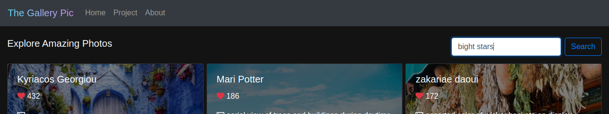
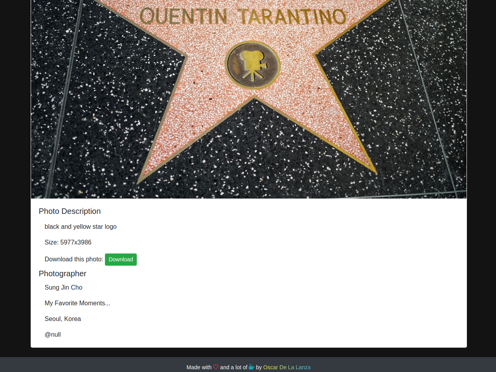

# The Gallery Pic

> This the Capstone Project that corresponds to the React & Redux Microverse course. So, as the name of the project suggest,
> The Gallery Pic is a photo browser built with different JS technologies like React, Redux, Bootstrap and the Unsplash API.
> Check the complete assigment here: [Catalogue of Statistics](https://www.notion.so/Catalogue-of-Statistics-72446e7fa33c403a9b6a0bc1de5c6cf5#ae194b0436a64e19bcc7ba295302118a)

## Catalogue of Statistics

## Built With
- `JavaScript`, `HTML`, `CSS`
- `React`, `Redux`, `Unsplash-JS`, `Font Awesome`
- `React-Bootstrap`, `React-Redux`, `Redux-Thunk`, `Redux-Logger`, `React-router-dom`, `prop-types`, `node-sass`

## Live Demo
Here you can find a Live Demo of the project with its latest features [The Gallery Pic](https://the-gallery-pic.web.app/).

### Getting Started 

This project was bootstrapped with [Create React App](https://github.com/facebook/create-react-app).

### Prerequisites

If you want to get a local copy of this project first make you have installed `Git` and `node-js` in your local environment.

### Setup

Clone the project by running any of the following commands: 
- SSH: `git clone git@github.com:oscardelalanza/capstone-unsplash.git`
- HTTPS: `git clone https://github.com/oscardelalanza/capstone-unsplash.git`
- GitHub CLI: `gh repo clone oscardelalanza/capstone-unsplash`
- ZIP: [Download](https://github.com/oscardelalanza/capstone-unsplash/archive/develop.zip)

### Install

Inside the project directory run `npm install` no install all the required `node_modules`.

Then execute `npm start` to run the app in the development mode.
Open [http://localhost:3000](http://localhost:3000) to view it in the browser.

### Usage

- Get the latest photographs from different artists since the beginning.

- Find what is relevant to you with in a simple way.

- Get all the info of your favorite photos with just a single click.

### Run tests

Execute `npm test` to launch the test runner in the interactive watch mode. See the section about
[running tests](https://facebook.github.io/create-react-app/docs/running-tests) for more information.

### Deployment

Execute `npm run build` to build the app for production to the `build` folder. It correctly bundles React in production
mode and optimizes the build for the best performance. See the section about [deployment](https://facebook.github.io/create-react-app/docs/deployment) for more information.

## Authors

👤 **Oscar De La Lanza**

- Github: [@oscardelalanza](https://github.com/oscardelalanza)
- Twitter: [@oscardelalanza](https://twitter.com/oscardelalanza)
- Linkedin: [Oscar De La Lanza](https://www.linkedin.com/in/oscardelalanza)
- Email: oscardelalanza@gmail.com

## 🤝 Contributing

Contributions, issues and feature requests are welcome!

Feel free to check the [issues page](https://github.com/oscardelalanza/capstone-unsplash/issues).

## Show your support

Give a ⭐️ if you like this project!

## Acknowledgments

- Unasplash Developers. 

## 📝 License

This project is [MIT](lic.url) licensed.
